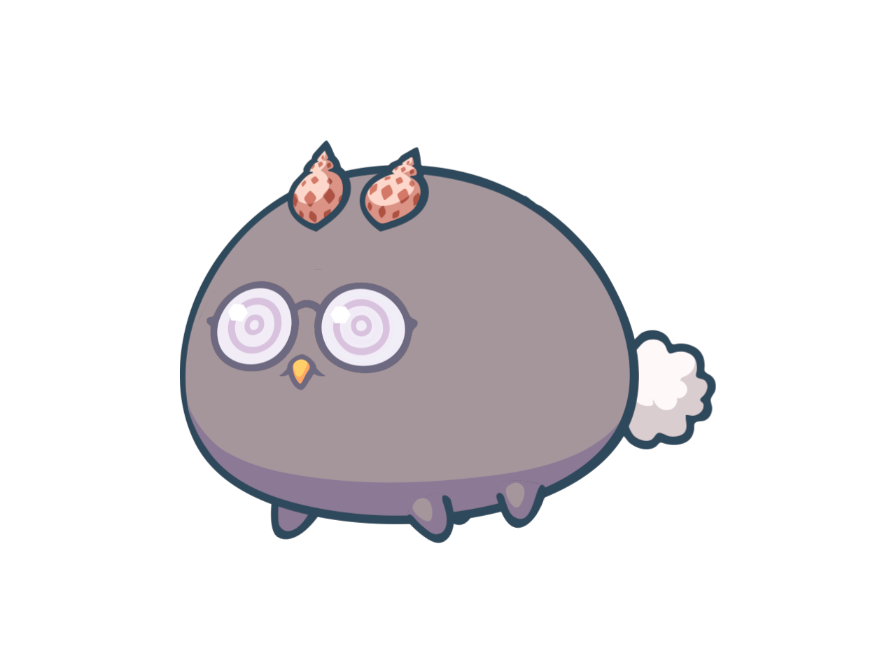

# Random pig




> This repository composes images based on axies shape and eyes/glasses.


## 🚀 How to run

Dependencies:
<!---Estes são apenas requisitos de exemplo. Adicionar, duplicar ou remover conforme necessário--->
* Using :
    - Yargs (to have command line script call)
    - Sharp (to actually compose the image)
    - Random (to randomize the shape, eyes or glasses)


Clone the repo:
```
git clone https://github.com/victorkl400/random-pig.git
```

Install Dependencies:
```
yarn
```

## Generate the image

Run on repository root:

```
yarn generate
```

It'll create a file named after the milisecons + shape + eye/glass options.


## 🤝 Contributors


<table>
  <tr>
    <td align="center">
      <a href="#">
        <br>
        <sub>
          <b>Me</b>
        </sub>
      </a>
    </td>
    <td align="center">
      <a href="#">
        <br>
        <sub>
          <b>Myself</b>
        </sub>
      </a>
    </td>
    <td align="center">
      <a href="#">
        <br>
        <sub>
          <b>I</b>
        </sub>
      </a>
    </td>
  </tr>
</table>

[⬆ Back to top](#random-pig)<br>